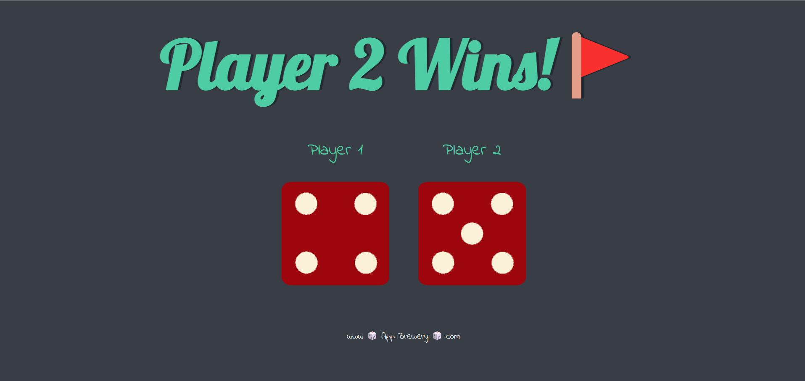

# TheDice-challenge
Simple game of Dice using the Javascript concept of Random Number Generation along with HTML and CSS.
The website simulates a dice game challenge where on every refresh both dice are thrown and a random dice face is generated for both players. The player with larger Dice wins!

## Instructions

 There is two dice on the page
 Just reload the page
 After every reload dice will change
 Which dice have the more point will win the challenge
